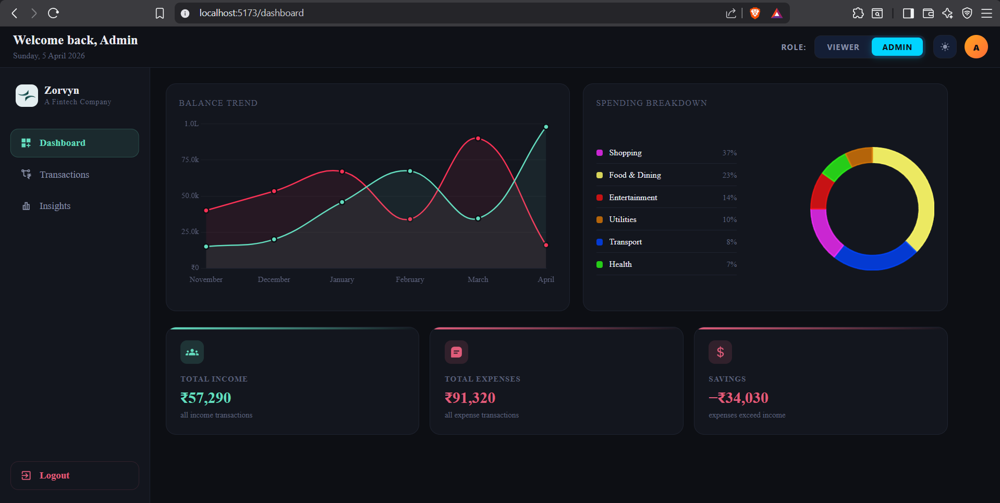
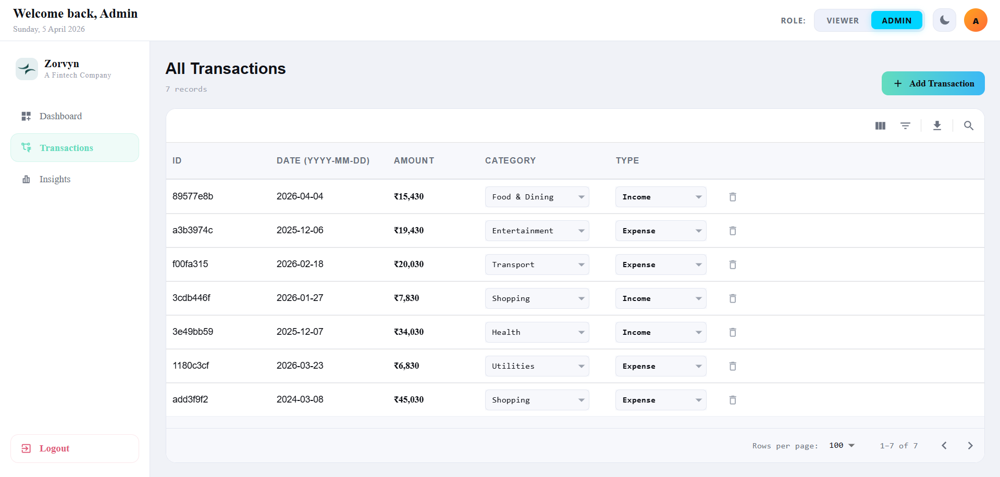
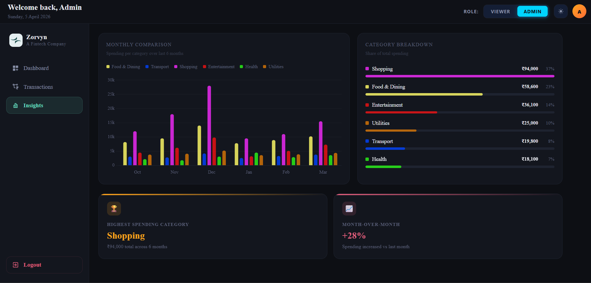

# Zorvyn — Fintech Dashboard 
### 🚀 **[Click on me to go live....](https://finance-dashboard-interface-coral.vercel.app/dashboard)**

A premium, responsive financial management dashboard built with React. Zorvyn provides a clean interface for tracking income, expenses, and spending insights — with role-based access control, persistent theme switching, and a data layer that closely mirrors real-world API behaviour.

---

## Tech Stack

| Technology | Purpose |
|---|---|
| React 19.2.4 | UI framework |
| Redux Toolkit | Global state (theme + role) |
| Tailwind CSS 4.2.2 | Utility-first styling |
| MUI (Material UI) | DataGrid, Dialogs, Date Picker |
| Chart.js + react-chartjs-2 | Line, Doughnut, Bar charts |
| Framer Motion | Animations and transitions |
| date-fns | Date formatting and manipulation |
| uuid | Unique transaction ID generation |

---

## Setup Instructions

### Prerequisites

- Node.js >= 18
- npm >= 9

### Installation

```bash
# 1. Clone the repository
git clone https://github.com/Utkarsh-Mauryaa/Finance-Dashboard-Interface.git
cd Finance-Dashboard-Interface

# 2. Install dependencies
npm install

# 3. Start the development server
npm run dev
```

Open [http://localhost:5173](http://localhost:5173) in your browser.

---

## Project Structure

```
src/
├── assets/                        # Static assets (logo, images)
├── components/
│   ├── DialogBoxes/
│   │   ├── AddTransactionDialog.jsx   # Add transaction form modal
│   │   └── DeleteConfirmDialog.jsx    # Delete confirmation modal
│   ├── layout/
│   │   ├── Layout.jsx                 # Page wrapper (sidebar + navbar)
│   │   ├── Loaders.jsx                # Skeleton loading components
│   │   └── Navbar.jsx                 # Top navigation bar
│   └── specific/
│       ├── ActionCard.jsx             # Summary stat card
│       ├── Charts.jsx                 # Line, Doughnut, Bar chart components
│       ├── InsightCard.jsx            # Insight metric card
│       ├── Sidebar.jsx                # Navigation sidebar
│       └── Table.jsx                  # DataGrid wrapper
├── lib/
│   └── features.js                    # Pure helper/utility functions
├── pages/
│   ├── Dashboard.jsx                  # Dashboard page
│   ├── Insights.jsx                   # Insights page
│   └── Transactions.jsx               # Transactions page
├── redux/
│   ├── reducer/
│   │   ├── adminCheck.slice.js        # Role (Admin/Viewer) slice
│   │   └── theme.slice.js             # Theme (dark/light) slice
│   └── store.js                       # Redux store
├── utils/
│   ├── sampleData.js                  # All application data
│   └── styles.jsx                     # Shared MUI sx styles and class strings
├── theme.js                           # CSS variable tokens + global MUI overrides
├── index.css                          # Tailwind v4 setup + design tokens
└── main.jsx                           # App entry point
```

---

## Architecture Overview

### Data Layer — Simulated API Behaviour

Rather than calling a real backend, the app simulates production API behaviour using `localStorage` as a persistent store, seeded from `sampleData.js` as the initial dataset.

On the Transactions page:

```
sampleData.js (seed)
    ↓
loadRows() — checks localStorage first, falls back to sampleData
    ↓
Component state (rows)
    ↓
Every mutation (add / edit / delete) → saveRows() → localStorage
```

This deliberately mirrors the pattern of a real app:

- **Initial load** behaves like a GET request — data is fetched and stored in state
- **Mutations** behave like POST/PUT/DELETE — state is updated then persisted
- **Loading states and skeletons** are shown during the simulated fetch delay, just as they would be during a real network request
- **Refresh persistence** works exactly as it would with a real API + cache layer

> Special emphasis: the loading skeleton, 1-second simulated delay, and localStorage persistence together create a faithful approximation of real API-driven data flow — without requiring a backend.

### State Management — Redux Toolkit

Two pieces of global state are managed via Redux Toolkit:

**Why Redux and not `useState` for role and admin?** Both the role and theme need to be accessible across every page and component simultaneously. Prop-drilling this deep would be fragile and hard to maintain. Redux provides a single source of truth that any component can read or update. For localized data, I relied on useState to keep component-level state encapsulated and the global store clean.

```
redux/
├── adminCheck.slice.js   →  isAdmin (boolean)
└── theme.slice.js        →  theme ("dark" | "light")
```

Both slices read their initial state from `localStorage` on startup, and write back to `localStorage` on every change — so role and theme survive page refreshes.

### Theme System

The theme is a two-layer system:

1. **Tailwind v4 `@theme` tokens** — generate utility classes like `bg-dark-surface`, `text-light-subtle`, `border-accent-green`. Components use `dark:` variants so they respond to the `.dark` class on the root wrapper.

2. **CSS custom properties** — `var(--accent)`, `var(--surface)`, `var(--text)` etc. flip between dark and light values based on the `.dark` class. These are consumed by MUI components (DataGrid, Dialog, Select) which live outside the Tailwind class tree.

`Layout.jsx` reads the theme from Redux and applies or removes the `.dark` class on the root wrapper — this single toggle cascades through the entire app instantly.

### Linked Data — Insights Page

The spending breakdown, bar chart, and insight cards on the Insights page all derive from the same source arrays in `sampleData.js`:

```
BREAKDOWN array
    ├── Doughnut chart (Dashboard)
    ├── Category breakdown progress bars (Insights)
    └── Highest Spending Category insight card

MONTHLY_CATEGORY_DATA array
    ├── Bar chart — monthly comparison (Insights)
    └── Month-over-Month insight card

income / expense arrays
    ├── Line chart — balance trend (Dashboard)
    └── Savings Rate insight card (Insights)
```

Any change to these source arrays automatically reflects across all connected components — no manual syncing required.

---

## Features

### Role-Based Access Control

The app has two roles switchable from the Navbar:

| Feature | Viewer | Admin |
|---|---|---|
| View transactions | ✅ | ✅ |
| Edit category / type | ❌ | ✅ (inline dropdown) |
| Add transaction | ❌ | ✅ |
| Delete transaction | ❌ | ✅ (with confirm dialog) |
| Export / download CSV | ✅ | ✅ |

Role persists across refreshes via Redux + localStorage.

### Dashboard Page 

- **Balance Trend(time based visualization)** — Line chart showing income vs expense over the last 6 months. Income line is teal, expense is red.
- **Spending Breakdown(categorical visualization)** — Doughnut chart with category-wise expenditure. Each segment shows its percentage of total spend in the legend.
- **Action Cards** — Three summary cards showing Total Income, Total Expenses, and Savings.
  - Savings card color is **teal/blue** when income exceeds expenses (positive savings)
  - Savings card color turns **red/pink** when expenses exceed income (negative savings)
  - The negative sign is explicitly displayed: e.g. `−₹12,000`

### Transactions Page 

- Paginated DataGrid showing all transactions (ID, date, amount, category, type)
- **Search** — filter rows by any field using the built-in toolbar search
- **Sorting** — sort data either in ascending or descending order
- **Advanced filtering** — column-level filters with condition operators (contains, equals, greater than, etc.)
- **Grouping** — group rows by category or type
- **Export** — download all transactions as a CSV file
- **Add Transaction** (Admin) — modal dialog with date picker, amount input, category and type selects, and full validation
- **Edit Transaction** (Admin) — inline dropdown selects for category and type directly in the table row
- **Delete Transaction** (Admin) — trash icon per row opens a confirm dialog showing a full preview of the transaction before deletion

### Insights Page 

- **Monthly Comparison Bar Chart** — grouped bar chart comparing spending across 6 categories over the last 6 months
- **Category Breakdown** — animated horizontal progress bars showing each category's share of total spending, sorted from highest to lowest
- **Insight Cards:**
  - 🏆 **Highest Spending Category** — derived from the category with the largest total value
  - 📈 **Month-over-Month(Useful observation from the data)** — percentage change in total spending vs the previous month. Color is green for decrease, amber for slight increase, red for large increase

### Global Features

- **Dark / Light theme** — toggle in the Navbar, persists via Redux + localStorage
- **Responsive design** — works across mobile, tablet, and desktop
- **Animations** — page elements animate in using Framer Motion with staggered delays
- **Loading skeletons** — each page shows a skeleton layout during the simulated data fetch
- **Smooth transitions** — theme switching, hover states, and card interactions all transition smoothly

---

## Key Design Decisions

**Separate Redux slices for theme and role** — keeping concerns separated makes each slice trivially testable and easy to extend (e.g. adding more roles or theme variants later).

**CSS variables for MUI theming** — MUI components render into portals outside the React component tree, so Tailwind `dark:` variants don't reach them. CSS custom properties (`var(--accent)`, `var(--surface)`) that flip with the `.dark` class solve this cleanly without needing a MUI `ThemeProvider`.

**`sampleData.js` as a single data source** — in a production system, this file would be replaced by API call results. The rest of the app architecture (state management, derived computations/calculation functions in `features.js`, component data flow) remains unchanged.

**Modular styles** — `styles.jsx` exports reusable MUI `sx` objects and Tailwind class strings, keeping component files clean and ensuring consistent styling across the app.

---

## Future Improvements

- Replace `sampleData.js` with real API calls (the architecture supports this with minimal changes)
- Add authentication (login page, protected routes)
- Connect Transactions data to Dashboard and Insights charts for a fully unified data model
- Add date range filtering on the Transactions page
- Budget limit alerts on the Insights page
